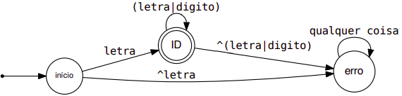
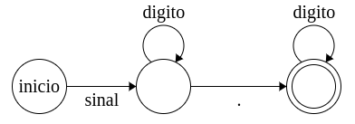

# Relatório com as expressões regulares do trabalho de Análise Léxica

**Autor:** Alexandre Aparecido Scrocaro Junior \
**R.A.:** 2135485

## Análise Léxica

### Resumo

TODO
TODO
TODO
TODO
TODO
TODO
TODO
TODO
TODO
**TODO**
_TODO_
TODO
TODO
TODO
TODO
TODO

---

### Especificação da linguagem de programação TPP

- Tipos básicos de dados suportado: **inteiro** e **flutuante**
- Suporte a arranjos uni e bidimensionais **(arrays)**
- Exemplos:
  - tipo: identificador[dim]
  - tipo: identificador[dim][dim]
- Variáveis locais e globais devem ter um dos tipos especificados
- Tipos de funções podem ser omitidos (quando omitidos viram um procedimento e um tipo void é devolvido explicitamente
- Linguagem quase fortemente tipificada: nem todos os erros são especificados mas sempre deve ocorrer avisos
- Operadores aritméticos: +, -, \* e /
- Operadores lógicos: e (&&), ou (||) e não (!)
- Operador de atribuição: recebe (:=)
- Operadores de comparação: maior (>), maior igual (>=), menor (<), menor igual (<=), igual (=)

---

### Especificação formal dos autômatos para a formação de cada classe de token da linguagem

#### Autômato de identificador

Primeiramente, as classes mais simples:

- letra = [a-zA-Z]+
- digito = [0-9]+

Agora, podemos criar um autômato de um identificador da seguinte forma:

#### Autômato de número flutuante

Primeiramente, as classes mais simples:

- sinal = [+-]\* (o sinal pode ter nada, é repassado com épsilon)
- digito = [0-9]+

Agora, podemos criar um autômato de um identificador da seguinte forma:

---

### Detalhes da implementação da varredura na LP e ferramenta (e/ou bibliotecas) escolhidas pelo projetista

&nbsp;&nbsp;O sistema de varredura, ou analisador léxico, é a fase do compilador na qual se lê o código-fonte como um arquivo de caracteres e o separa em um conjunto de tokens, os quais são reconhecidos através das expressões regulares. A implementação do analisador será explicada a seguir.\
&nbsp;&nbsp;Em primeiro lugar, define-se os tokens, palavras reservadas e operadores que serão utilizados para reconhecer as facilidades da linguagem TPP, assim como suas expressões regulares. Após isso, foram definidas as funções para reconhecer as classes (ID - que requer atenção especial para não coincidir com nenhuma palavra reservada, notação científica, número de ponto flutuante, número de ponto inteiro, comentários, novas linhas e colunas).\
&nbsp;&nbsp;Além disso, também são reconhecidos erros de caracteres especiais que a linguagem não contém (como $ e ç) e é mostrada sua posição no código (linha e coluna).\
&nbsp;&nbsp;Por último, o código retorna a lista de tokens correspondentes ao arquivo escolhido por quem executa o comando para iniciá-lo, percorrendo todo o código TPP do arquivo selecionado.

&nbsp;&nbsp;A ferramenta utilizada foi o Python PLY, que é uma implementação do lex e yacc e utiliza LR-parsing - que é razoavelmente eficiente. O lex possui a facilidade na tokenização de uma _string_ de entrada, por exemplo:

**_String_ de entrada:**\
x = 3 + 42 \* (s - t)\

**_String_ após tokenização:**\
'x','=', '3', '+', '42', '\*', '(', 's', '-', 't', ')'

**_Tokens_ obtidos:**\
ID, IGUAL, INTEIRO, MAIS, INTEIRO, VEZES, ABRE_PARENTESE, ID, MENOS, ID, FECHA_PARENTESE

---

### Exemplos de saída do sistema de varredura (lista de tokens) para exemplos de entrada (código fonte)

#### Código para verificar valor 10:

**ENTRADA:**\

**SAIDA:**\
INTEIRO\
ID\
ABRE_PARENTESE\
FECHA_PARENTESE\
INTEIRO\
DOIS_PONTOS\
ID\
ID\
ATRIBUICAO\
NUM_INTEIRO\
REPITA\
SE\
ID\
IGUAL\
NUM_INTEIRO\
ESCREVA\
ABRE_PARENTESE\
[6,12]: Caracter inválido ' " '\
ID\
NUM_INTEIRO\
[6,21]: Caracter inválido ' " '\
FECHA_PARENTESE\
FIM\
ID\
MAIS\
MAIS\
ID\
ID\
IGUAL\
NUM_INTEIRO\
ID\
ABRE_PARENTESE\
NUM_INTEIRO\
FECHA_PARENTESE\
FIM

#### Código de produto escalar:

**ENTRADA:**\

**SAIDA:**\
INTEIRO\
ID\
ABRE_PARENTESE\
INTEIRO\
DOIS_PONTOS\
ID\
ABRE_COLCHETE\
FECHA_COLCHETE\
VIRGULA\
INTEIRO\
DOIS_PONTOS\
ID\
ABRE_COLCHETE\
FECHA_COLCHETE\
VIRGULA\
INTEIRO\
DOIS_PONTOS\
ID\
FECHA_PARENTESE\
INTEIRO\
DOIS_PONTOS\
ID\
ID\
ATRIBUICAO\
NUM_INTEIRO\
INTEIRO\
DOIS_PONTOS\
ID\
ID\
ATRIBUICAO\
NUM_INTEIRO\
SE\
ID\
MAIOR\
NUM_INTEIRO\
ID\
REPITA\
ID\
ATRIBUICAO\
ID\
MAIS\
ID\
ABRE_COLCHETE\
ID\
FECHA_COLCHETE\
MULTIPLICACAO\
ID\
ABRE_COLCHETE\
ID\
FECHA_COLCHETE\
ID\
ATRIBUICAO\
ID\
MAIS\
NUM_INTEIRO\
ID\
ID\
IGUAL\
ID\
RETORNA\
ABRE_PARENTESE\
ID\
FECHA_PARENTESE\
FIM

---

### Implemente uma função que imprima a lista de tokens, não utilize a saída padrão da ferramenta de implementação de Analisadores Léxicos

